# Xilinx Vivado setup for source control

This was tested on Vivado version 2019.1

Here is one way to structure your FPGA project so that it is compatible with
both Xilinx Vivado GUI in project mode and version control.  This setup
allows you to check in the minimum number of files needed so that you can
easily recreate the project in another workspace.

To save you some time:

* Once you have a Vivado project, you can not move it to a different directory.  The project files are filled with absolute paths.  It is therefore pointless to check in the entire project.

* There is a TCL command "write_project_tcl" which generates a TCL script which rebuilds the project in a new directory.  This method is shown here.

* Even with "write_project_tcl", the project has to be structured correctly or the script will not work.  In particular, none of the files needed to recreate the project should be in the project subdirectory.

Although it's possible to script the entire FPGA build process, it is
also important to be able to use project mode to access the Vivado GUI for
such tasks as debugging with the integrated logic analyzer and pin-planning.

If your setup is incorrect, you will waste a lot of time fixing it, or
create a mess in your repository by checking in too many files. 
Unfortunately, Vivado really would like your source code to be in the
project directory, so you have to actively fight it to prevent this.

The directory structure should be this:

    example_fpga/
        rebuild.tcl   - TCL script created by Vivado.  Checked in.
        rtl/          - Your Verilog (or VHDL) source code.  All checked in.
        cons/         - Your constraint files.  All checked in.
        project_1/    - Vivado project.  Nothing here is checked in.
        ip/           - Xilinx IP.  Some files checked in.

The idea is to have the minimal set of files checked in so that you get the
Vivado project back after a fresh clone.  You should only have to type these
commands:

    git clone https://github.com/jhallen/example_fpga.git
    cd example_fpga
    vivado -source rebuild.tcl

Also, you can always delete project_1/ and rebuild it:

    rm -rf project_1
    vivado -source rebuild.tcl

The ip/ directory gets polluted with derived files, but at least Vivado
tells you which ones need to be saved in source control.

# Initial project build

Suppose you don't have the project_1/ and rebuild.tcl script.  This is how
to create them.

Start Vivado.  Change directory to example_fpga first. [There are other
possibilities here, but this will get you started.]

    cd example_fpga
    vivado

Go through the usual sequence of creating a project, but do not check any of
the boxes that say "copy into project":

You need your Verilog or VHDL source files:

You need the .xci files for Xilinx "IP Catalog" IP.  You also need the
wrapper file for block designs (see below for more about this).

Do not check the box here:

You need your constraint files:

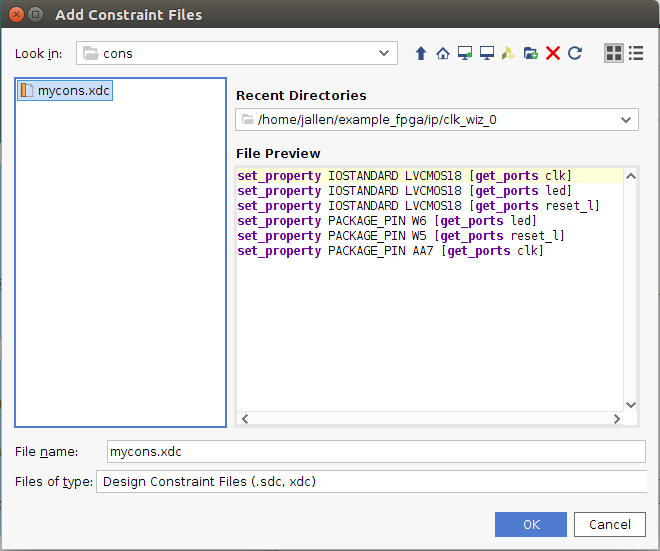

Don't check it here either!

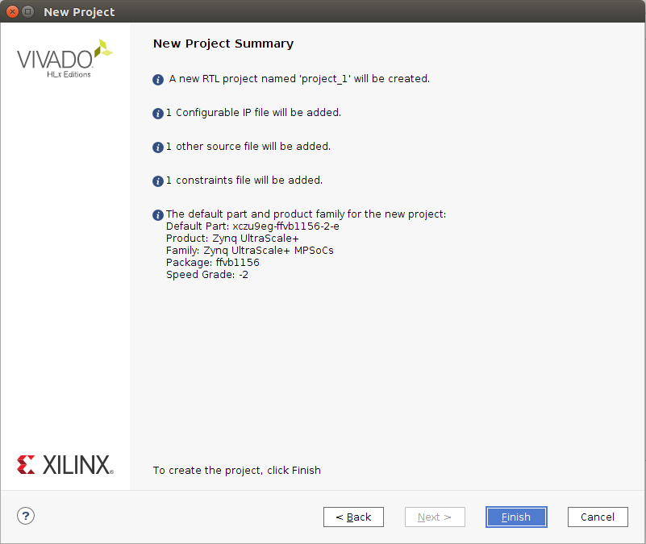

Then we wait a long time, why is Vivado so slow?

Now finally the project appears:

# Save the script

Use the write_project_tcl command to save the script:

Here are the messages this command prints:

That's it.  Now you can regenerate the project with:

    rm -rf project_1
    vivado -source rebuild.tcl

Note that the rebuild.tcl script shows you the files that need to be saved
in source control in comments.  This is in the file:

    # 3. The following remote source files that were added to the original project:-
    #
    #    "/home/jallen/example_fpga/ip/clk_wiz_0/clk_wiz_0.xci"
    #    "/home/jallen/example_fpga/rtl/testtop.v"
    #    "/home/jallen/example_fpga/cons/mycons.xdc"

You will have big problems if any of these are in the project directory
(example_fpga/project_1 in this case).

It does not work to delete the project_1/ directory, and sneakily write the
files back.  First the rebuild.tcl script will fail in the line with
create_project because the directory already exists.  You can try to get
around this by adding -force the line with create_project.  Unfortunately,
create_project -force deletes the entire directory, so then Vivado will
complain that the files are missing.  Also, you will be writing out
rebuilt.tcl many times, so you don't want to edit it.

You really need to create the source files outside of the project directory
in the first place.

# Xilinx IP

The next difficulty is that Xilinx IP from the "IP Catalog" is written by
default to the project directory.

An example is the clock wizard IP to use the PLL or MMCM.

Take note of the "IP Location" in the top left of the window.  It should
just show you the location, but the GUI design is bad here so have to click
on it.

When you click on it, you will see that it wants to put it in the project:

Instead put it in the ip/ directory.

You need to generete the output products, even though they do not have
to be saved in git.  When you generate them here, then Vivado knows to
regenerate them when you rebuild the project.

Just the .xci file needs to be saved in source control, but it's a good idea
to run the write_project_tcl command and check the comments to be sure.

Unfortunately the output products are generated in the same tree as the .xci
files, so you have to pay close attention to the ip/ directory.

# IP Integrator / Block design

Block designs must also be created outside of the project directory (for
example, in our ip/ directory).  This is odd, because the block design ends
up as a set of commands in the project tcl script produced by
write_project_tcl.  The problem is that the HDL wrapper file is not produced
by the project tcl, but must exist for this script to work without failing.

When block designs are produced in ip/, many files are generated, but only
the wrapper file has to be checked into the source control.  This file is
in the list in the comments of the project tcl script:

    # 3. The following remote source files that were added to the original project:-
    #
    #    "/home/jallen/tryit/ip/design_1/hdl/design_1_wrapper.v"
    #    "/home/jallen/tryit/cons/mycons.xdc"

Anyway, when you create a block design, the default is for it to be produced
inside the project:

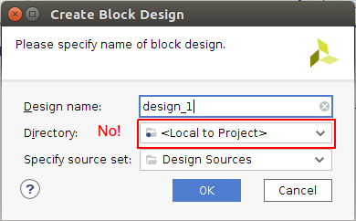

Change this to ip/:

Now we create the block design:

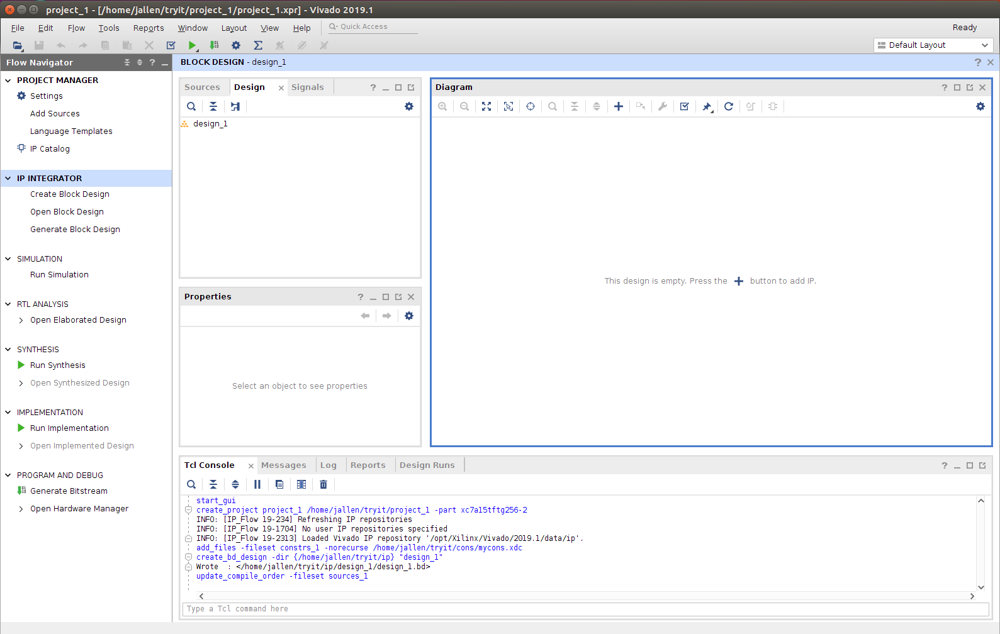

Right click on the block design and create the HDL wrapper:

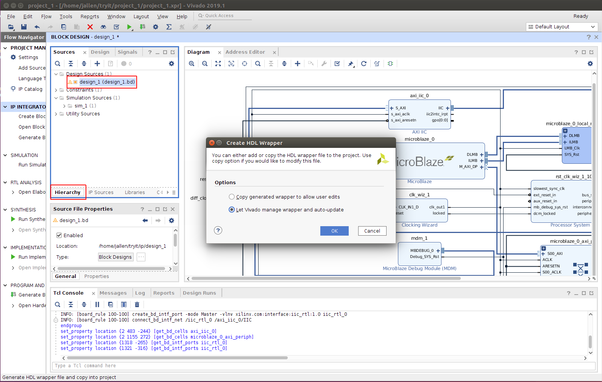

That's it. Now you have the files necessary for checking into source control
so you can use the write_project_tcl command.

# Xilinx SDK / Eclipse

Here is one way to structure your Xilinx SDK project so that it compatible
with version control.  The goal here is to check in the minimum number of
files so that an XSDK software project can be recreated in a new repository. 
Only files that we create should be checked in, not derived files.

But first, let's review a little about how XSDK works.  First thing you
must do is export the hardware .hdf file from Vivado:

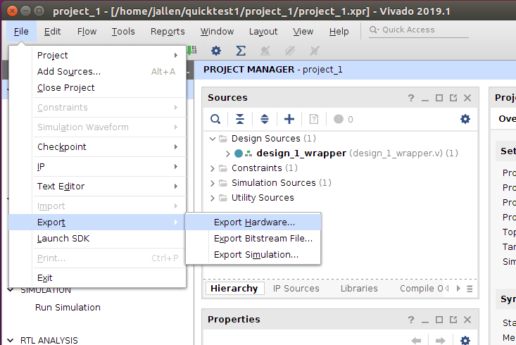

As usual, Vivado will want to put it in the project:

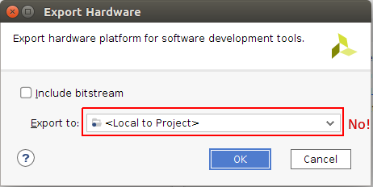

You should save it somewhere else, perhaps at the top level since this is
the one file that the software team will care about:

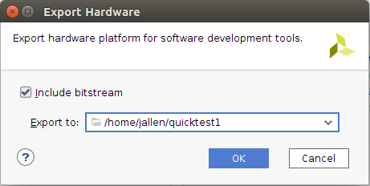

The .hdf file is a .zip file containing the list of peripherals in your
design, the address map and possibly the .bit file- basically everything the
software needs to know about the hardware:

     ~/quicktest1 unzip -v design_2_wrapper.hdf 
    Archive:  design_2_wrapper.hdf
     Length   Method    Size  Cmpr    Date    Time   CRC-32   Name
    --------  ------  ------- ---- ---------- ----- --------  ----
         620  Defl:N      353  43% 2019-11-18 16:34 619e2f0a  sysdef.xml
      261182  Defl:S    24932  91% 2019-11-18 16:34 0959ea2b  design_1.hwh
       15855  Defl:S     4021  75% 2019-11-18 16:34 00750531  design_1_bd.tcl
     1241916  Defl:S    58412  95% 2019-11-18 16:34 de68834d  design_1_wrapper.bit
        1436  Defl:S      629  56% 2019-11-18 16:34 014b194a  design_1_wrapper.mmi
    --------          -------  ---                            -------
     1521009            88347  94%                            5 files

Now we start xsdk, either through Vivado:

Of course, it assumes you want the files in the project:

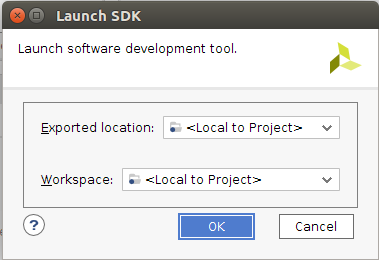

You should put the workspace (where xsdk will put the software projects you
create) outside of the Vivado project.  The "Exported Location" is the
directory where the .hdf file was placed:

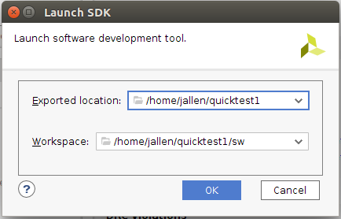

Alternatively, you can start xsdk from the command line:

	xsdk -workspace sw -hwspec design_1_wrapper.hdf

XSDK starts, and automatically runs a sequence to create a hardware wrapper
project from the .hdf file:

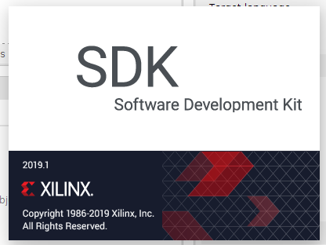

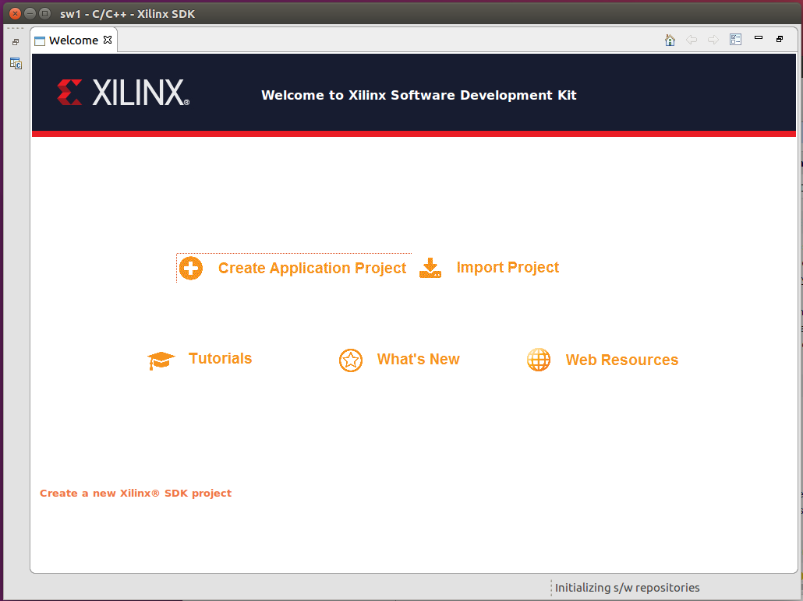

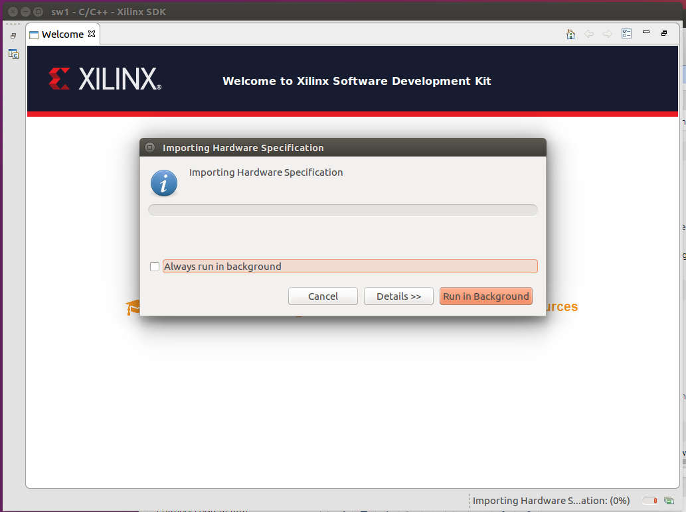

You finally end up with one project in the workspace, the hardware wrapper
project:

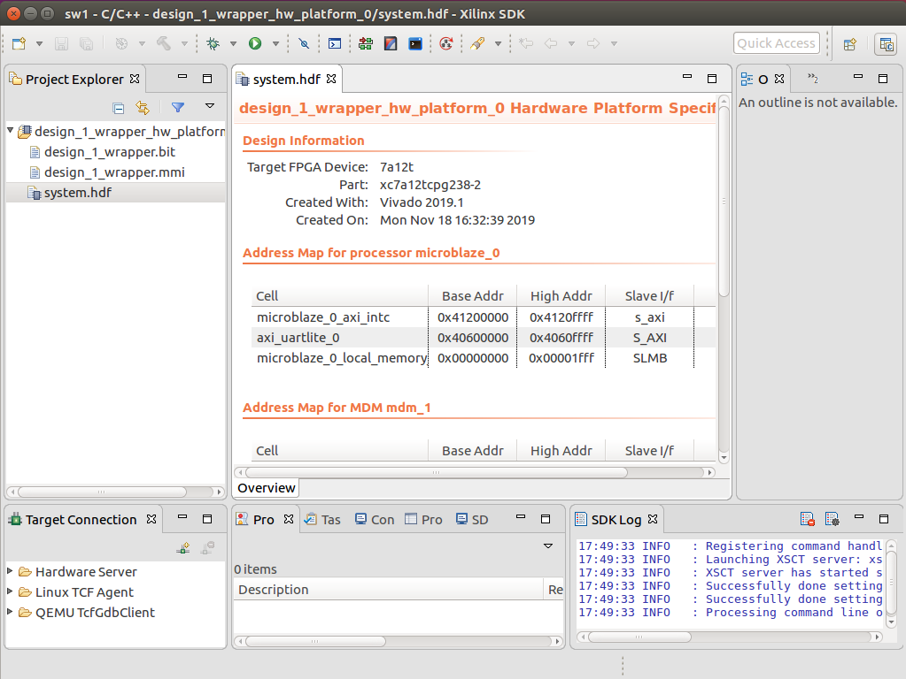

You then may create an application project based on a template:

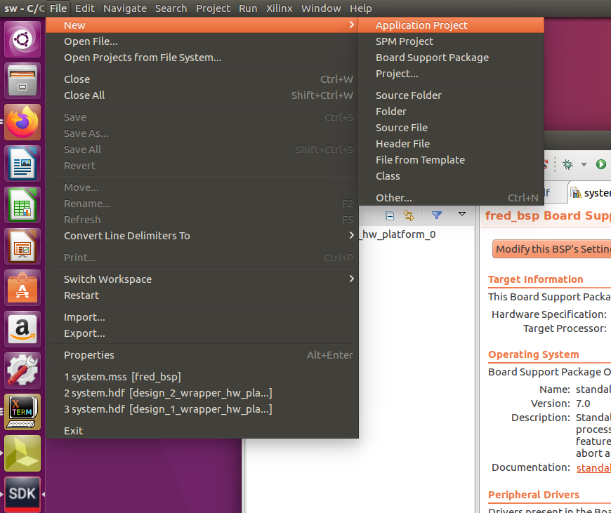

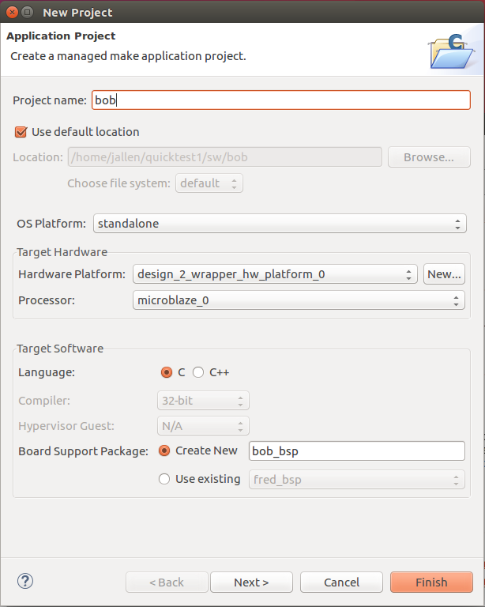

You can select the OS: standalone, linux or freertos.  We pick standalone:

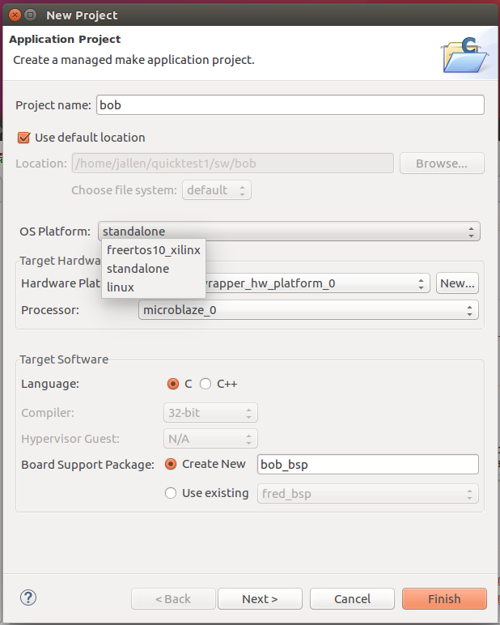

And you select one of the template projects:

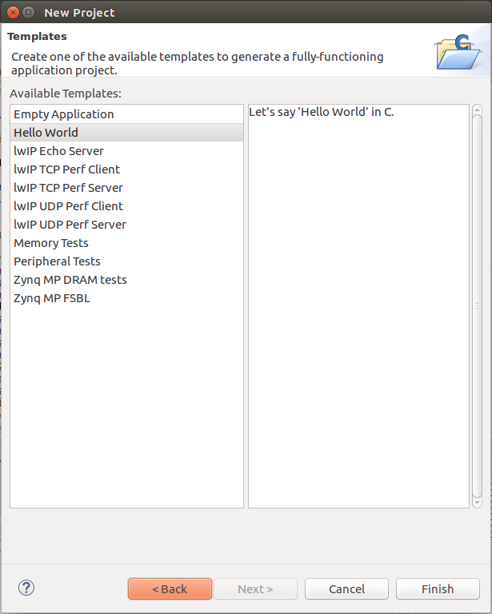

XSDK creates the application project and a BSP project for it.  The BSP
project has the source code for the peripherals that are included in the
hardware.  You end up with three projects:

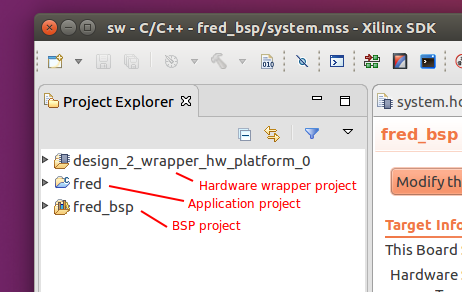

We want the project to work through the XSDK Eclipse GUI to enhance the
convenience of certain tasks:

* XSDK GUI allows you to casually create new software projects.  For example you may need to create the Xilinx Zynq memory test project when your board comes in to validate the DRAM or you may want to create a standalone project instead of full Linux for board bringup tasks.

* XSDK GUI allows you to connect to the target and debug without using any other tools.

On the other hand, for larger software projects and Linux you will almost
certainly want to use scripting.  You should include in your Linux build
script the steps needed to create the device tree and the FSBL (first stage
bootloader) from the .hdf file.

Here is a quick summary:

* Check in only the application project source code plus the Eclipse project files for it.  Leave out the BSP project and hardware wrapper project.

* Also check in the .hdf file.  Make sure the .hdf file is not generated in the Vivado project directory.

* On a fresh clone, you need to rebuild the BSP project that the application project wants to reference.  Mainly this means that you have to remember to use the name it expects (usually "foo_bsp" for an application called "foo").

The directory structure will look like this:

    example_fpga/
        rebuild.tcl   - TCL script created by Vivado.  Checked in.
        rtl/          - Your Verilog (or VHDL) source code.  All checked in.
        cons/         - Your constraint files.  All checked in.
        project_1/    - Vivado project.  Nothing here is checked in.
        ip/           - Xilinx IP.  Some files checked in.
        design_1_wrapper.hdf
                      - The exported hardware.
        sw/           - Becomes the XSDK / Eclipse workspace
        sw/foo/                 - The application project
        sw/foo/src/             - Source code for the application project. All checked in.
        sw/foo/.project         - Eclipse project file.  Checked in.
        sw/foo/.cproject        - Eclipse project file.  Checked in.
        sw/foo/Debug/           - Application binary.  Not checked in.
        sw/design_1_wrapper_hw_platform_0
                                - Hardware wrapper project derived from .hdf file. Not checked in.
        sw/foo_bsp/             - BSP project derived from wrapper. Not checked in.
        sw/.metadata            - Eclipse workspace crap.  Not checked in.

It is important to understand some issues with the XSDK:

* When you start it with the -hwspec option (as it is when you "Launch SDK" from Vivado), there is a very high chance that it will import the hdf as a new design wrapper project instead of updating your existing one.

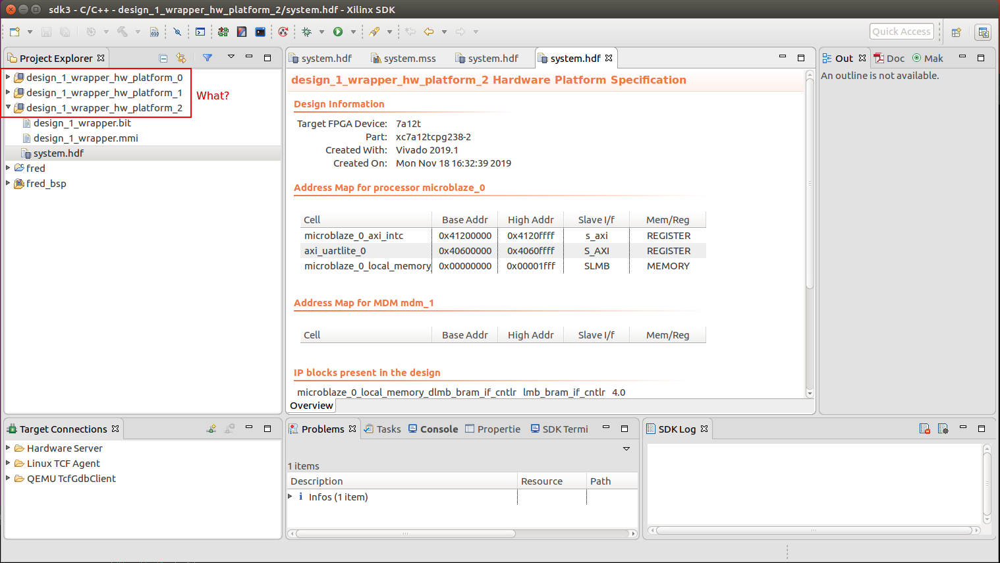

* Then if you do end up with multiple design wrapper projects, it will be unclear which one is being referenced by the BSP project.  The "system.mss" within the BSP shows it, but will you remember to look?  Chances are high that you will compile the code with the old hardware.

* Related things are broken.  For example, you can right-click on an applicaiton project for "Change Referenced BSP", but it's broken- the window comes up blank.  This implies that you do not want to end up with multiple BSPs.

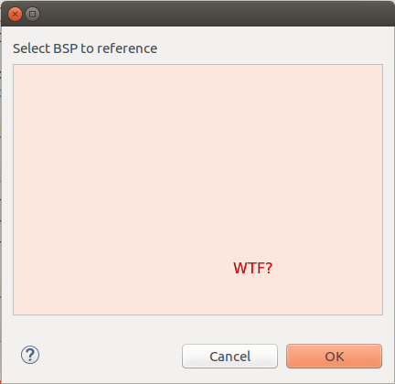

Luckily, the application project references the BSP project with a relative
path, so you can move the application project as long as the BSP project is
created in the same relative position.  Also, Eclipse allows you to import
projects which are already physically in the workspace.  So it works for
Eclipse to start a new workspace with your application source code already
there.
